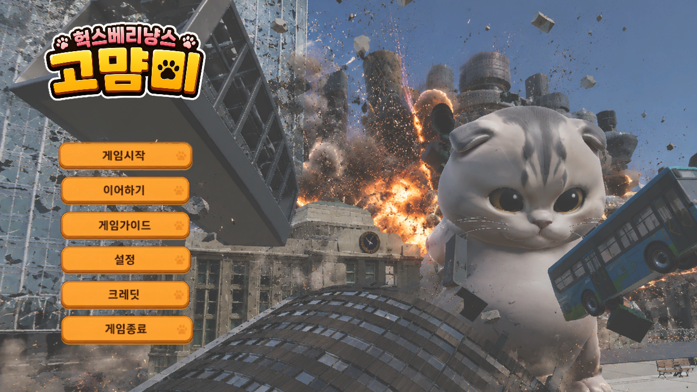
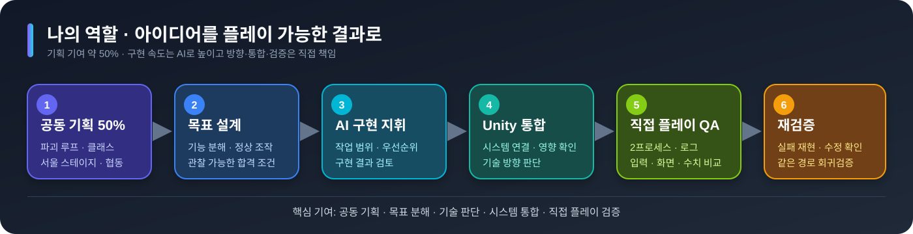
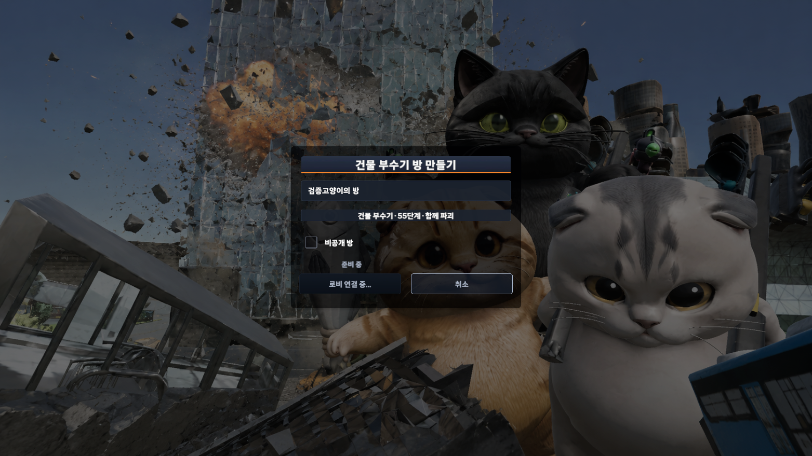
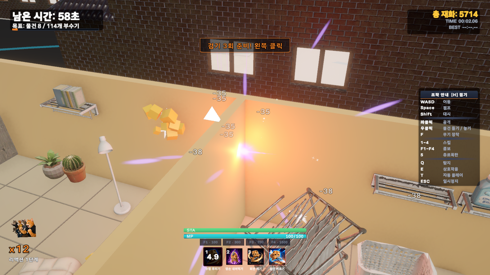
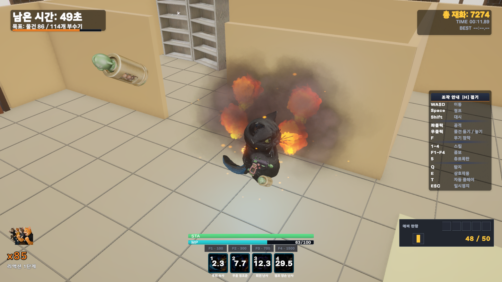
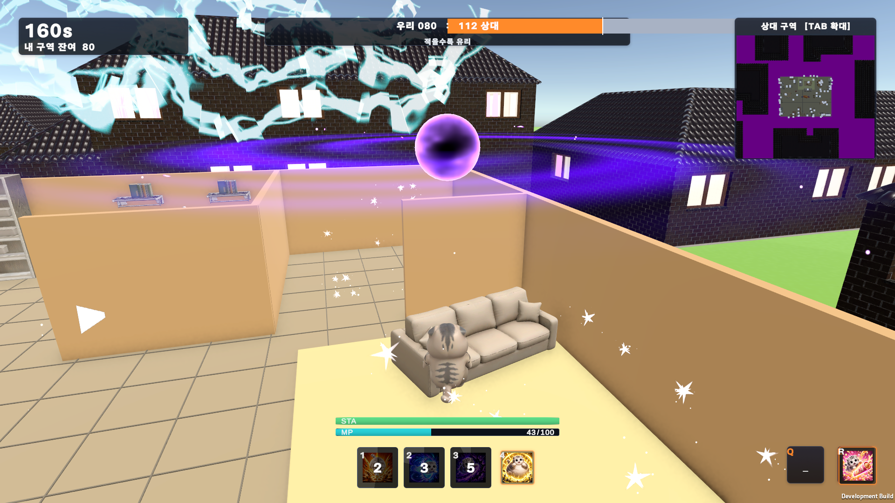
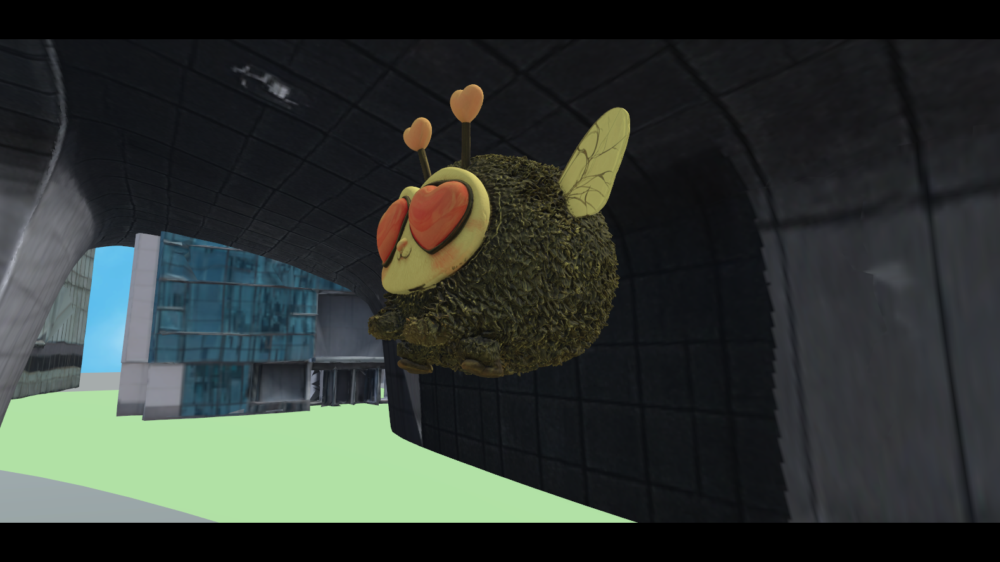

# 냥발스럽게 · CatDream

> Unity 6 고양이 파괴 액션 · 3개 클래스 · 스토리·협동 모드 · 직접 플레이 QA

냥발스럽게는 고양이가 서울형 스테이지의 오브젝트와 건물을 파괴하며 성장하는 액션 프로토타입입니다. 3개 클래스, 스토리 진행, 업그레이드와 저장, 동료, 협동 건물 파괴 모드를 결합했습니다.

이 저장소는 포트폴리오용 선별 소스입니다. 비공개 작업 프로젝트에는 제3자 패키지, 서비스 설정, 생성 빌드와 130GB 이상의 에셋·검증 자료가 있어 전체 프로젝트를 재배포하지 않았습니다.

## 프로젝트 1분 요약

| 항목 | 내용 |
| --- | --- |
| 장르 | 3인칭 파괴 액션 / 협동 점수 경쟁 |
| 엔진 | Unity 6000.3.6f1, URP 17.3, C# |
| 콘텐츠 | 서울형 6개 스테이지, 스토리, 건물 파괴 전투 |
| 클래스 | 기본형, 근접형, 총기형 |
| 주요 시스템 | 전투 스킬, 업그레이드, 저장 마이그레이션, 동료, 무기 부착 |
| 멀티플레이 | Photon 방 흐름, 원격 아바타, 호스트 권한형 결과 |
| QA | PlayMode, 개발 빌드 탐침, 호스트·클라이언트 2프로세스 증거 |
| 공개 범위 | 주요 C# 15개, 테스트 3개, 보고서 3개, 플레이 화면 |

## 나의 역할과 기여

AI를 구현 도구로 활용했으며, **게임 방향·목표·기술 판단·Unity 통합·최종 검증**을 담당했습니다.

## 가장 먼저 볼 자료

1. [문제 해결 사례](PORTFOLIO.md)
2. [선별 소스 안내](SOURCE_INDEX.md)
3. [클래스 스킬 VFX 검증](Evidence/CLASS_SKILL_EXTERNAL_VFX_REPORT.md)
4. [스토리·협동 최종 보고서](Evidence/STORY_COOP_FINAL_REPORT.md)
5. [협동 회귀검증 보고서](Evidence/COOP_REGRESSION_REPORT.md)

## 추천 코드 7개

| 주제 | 코드 | 핵심 기술 |
| --- | --- | --- |
| 근접 전투 | [MeleeCatCombatRuntime.cs](Source/Classes/MeleeCatCombatRuntime.cs) | 콤보 버퍼, 방패 돌진, 호·구·캡슐 판정과 4개 스킬 |
| 총기 전투 | [GunCatCombatRuntime.cs](Source/Classes/GunCatCombatRuntime.cs) | 탄약·조준, 투사체 풀, 회전·난사 스킬 |
| 전투 스테이지 | [BuildingBreakDirector.cs](Source/BuildingBreak/BuildingBreakDirector.cs) | 호스트 기반 단계 진행과 중복 전환 방지 |
| 클래스 성장 | [BuildingBreakPlayerProgress.cs](Source/BuildingBreak/BuildingBreakPlayerProgress.cs) | 클래스별 업그레이드, 경제, 마이그레이션, 세션 아이템 |
| 원격 아바타 | [CoopNetworkPlayerAvatar.cs](Source/Coop/CoopNetworkPlayerAvatar.cs) | 이동·공격·장비·스킬·동료 상태 동기화와 복구 |
| 저장 | [SaveSystem.cs](Source/Core/SaveSystem.cs) | 스토리 축, 업그레이드 이전, 장비·스테이지·설정 |
| 무기 부착 QA | [WeaponAttachmentProfile.cs](Source/Core/WeaponAttachmentProfile.cs) | 지오메트리 서명, 자세·간격 판정과 JSON/CSV 증거 |

## 대표 문제 해결

### 동시 타격으로 스테이지가 두 번 넘어가는 문제

건물 체력이 동시에 0이 되면 두 요청이 다음 단계 전환을 중복 실행할 수 있었습니다. 호스트만 결과를 확정하고 마지막 적용 단계를 기록해 같은 전환이 두 번 처리되지 않도록 했습니다.

### 원격 플레이어가 위치만 움직이는 문제

멀티플레이 아바타는 좌표만 맞는다고 완성되지 않습니다. Idle, BackWalk, RunForward, Jump, Dash와 공격 변형, 장비, 스킬 효과, 거대화, 동료까지 작은 상태로 직렬화해 원격 프록시에 적용했습니다. 중요한 장비 상태는 신뢰 가능한 복구 경로를 추가했습니다.

### 클래스 저장 데이터가 서로 섞이는 문제

과거 공용 업그레이드를 클래스별 키로 이전하고, 스토리·협동·장비·설정·세션 전용 폭탄의 저장 경계를 분리했습니다. 파괴적인 테스트 뒤에는 기준값이 확보된 항목만 복원했습니다.

## 플레이 화면

| 협동 건물 파괴 방 | 근접 클래스 스킬 |
| --- | --- |
|  |  |

| 총기 클래스 난사 | 전투 HUD |
| --- | --- |
|  |  |

## 기록된 검증

- 클래스 스킬 8개: 공개 입력 PlayMode 1/1 Passed, Windows 개발 빌드 오류 0, 독립 실행 검증 Passed
- 접지·이동: 3개 클래스 Stage 4 스폰·다리 통과, 기록된 최대 지면 오차 0.01m
- 멀티플레이: 호스트·클라이언트 타이머 일치, 방 재생성·재입장, 기권 결과, 클래스 소개·VFX 검증 기록
- 스토리 협동: 원격 스킬, 이동 상태, 동시 타격 권한, 롤백, 업그레이드, 스테이지 완료와 강제 종료 복구 실행

## 실패와 한계도 공개합니다

- 2인 실패 결과 화면에서 실제 인원보다 기여 행이 많이 만들어진 하위 검증은 Failed입니다.
- Stage 4 2인 성능의 1% low가 목표를 충족하지 못해 Failed입니다.
- 원본 빌드의 비차단 경고를 추가 정리해야 합니다.
- 선별 소스만으로는 컴파일할 수 없으므로 현재 독립 상태는 NotValidated입니다.

## 권리와 재사용

스크린샷에는 라이선스가 있는 모델, 효과, 폰트와 환경 에셋이 보일 수 있습니다. 원본 파일, Photon·PlayFab 설정, 로컬 패키지, 빌드와 인증정보는 제외했습니다. [RIGHTS.md](RIGHTS.md)를 참고해 주세요.
